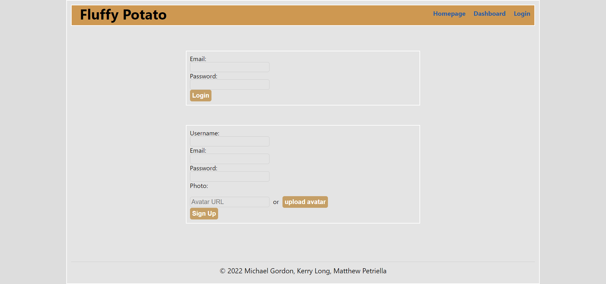
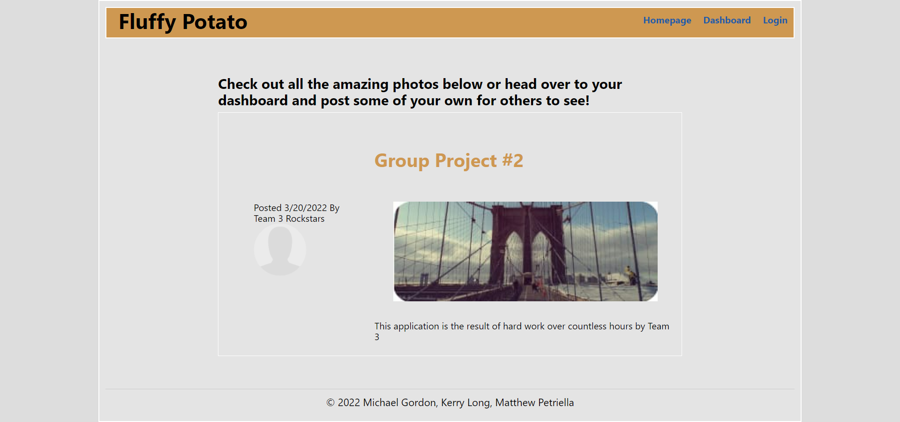
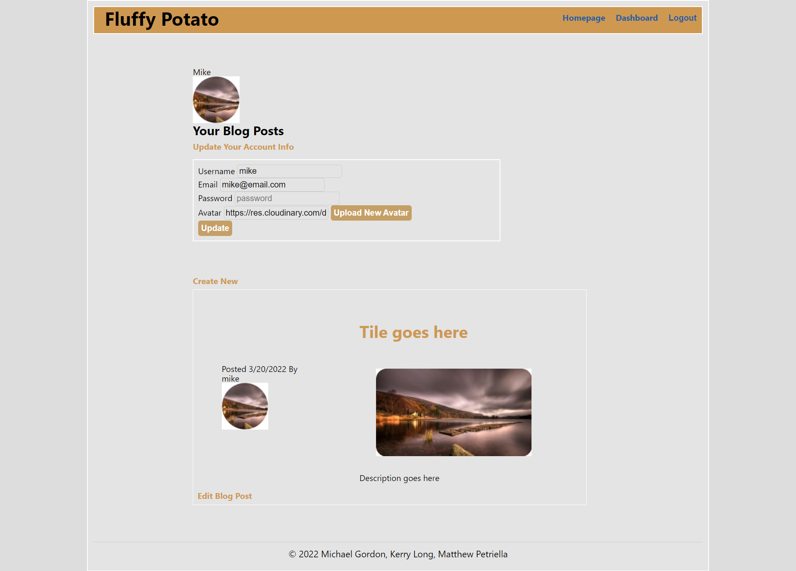
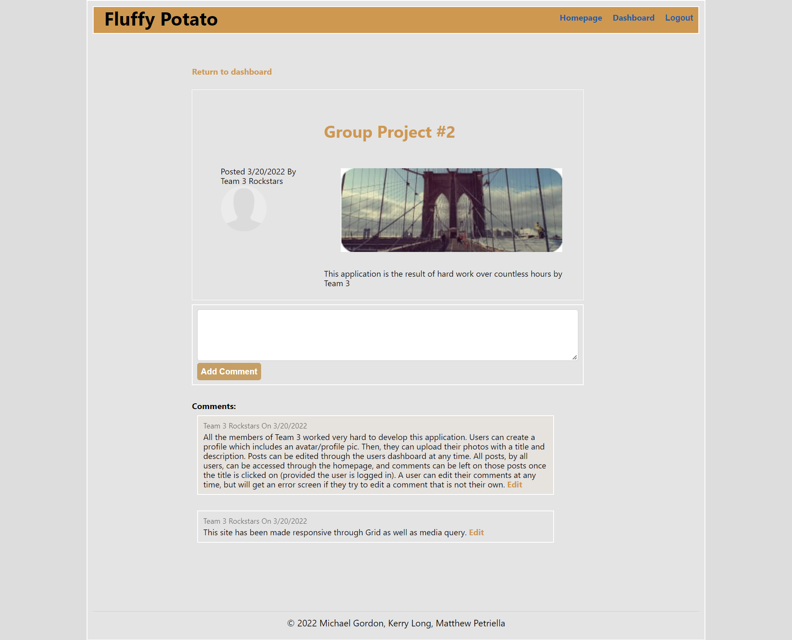
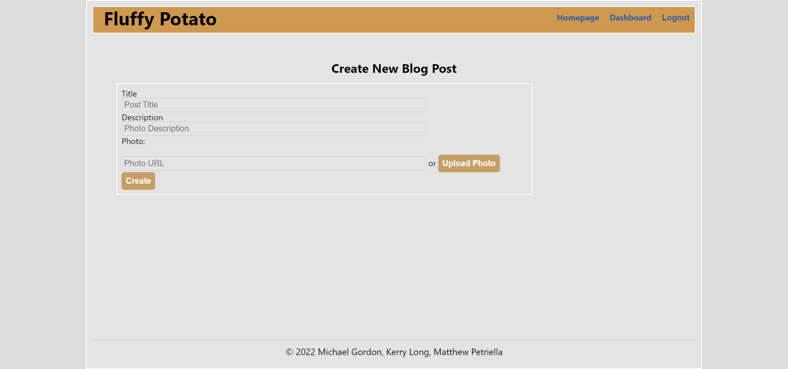

# Fluffy Potato Photos

## Description

Fluffy Potato is a photo sharing application that allows photo lovers to share photos, comment on photos, and express themselves through a unique avatar image.  Photos posted have a title and description that can be edited through a user dashboard.  In fact, the image itself can be changed in the dashboard.  Comments left can be read in the dashboard view or in the single item view when the title link is clicked.  Once a comment is left, it can be edited or deleted, but only by the person that left it.

## Table of Contents

*[Installation](#installation)

*[Technologies Used](#technologies-used)

*[Usage](#usage)

*[License](#license)

*[Contributing](#contributing)

*[Tests](#tests)

*[Questions](#questions)

## Installation

The application can be used as deployed to Heroku [HERE](https://rocky-river-85271.herokuapp.com/).  If you want to check the application out on local, please start by cloning the repo and running npm install to get all dependencies.  Once that process is completed, simply type npm start in the command line and the server will start on port 3000.  Visit localhost:3000 to see the running application.

## Technologies Used

-bcrypt

-cloudinary

-connect-session-sequelize

-dotenv

-express

-express-handlebars

-express-session

-mysql2

-path

-sequelize

## Usage

When you first visit the site, you will find all existing photo posts listed on the homepage.  In order to see existing comments, you can simply click on the title of any photo post.  In order to leave a comment, or create a photo post of your own, you will need to sign up or log in.  Once logged in, comments can be left on any photo post you'd like, but only your comments can be edited.  Visit the dashboard to create your own photo post by providing a title, description, and uploading an image file. If you decide you'd like to edit any part of the post, just select the edit post link that can be found at the bottom of any photo post in your dashboard view.

## License
This application is covered under the [MIT](./License/MIT.txt) license.
  
## Contributing

Pull requests are welcome. For major changes, please open an issue first to discuss what you would like to change.

## Tests

All routes have been thoroughly tested through insomnia

## Questions

If you have any questions, please contact [Mike](mailto:vprmatrix55@gmail.com), Matt, or Kerry via email, or through their GitHub pages [Mike](https://github.com/Mike2481)

